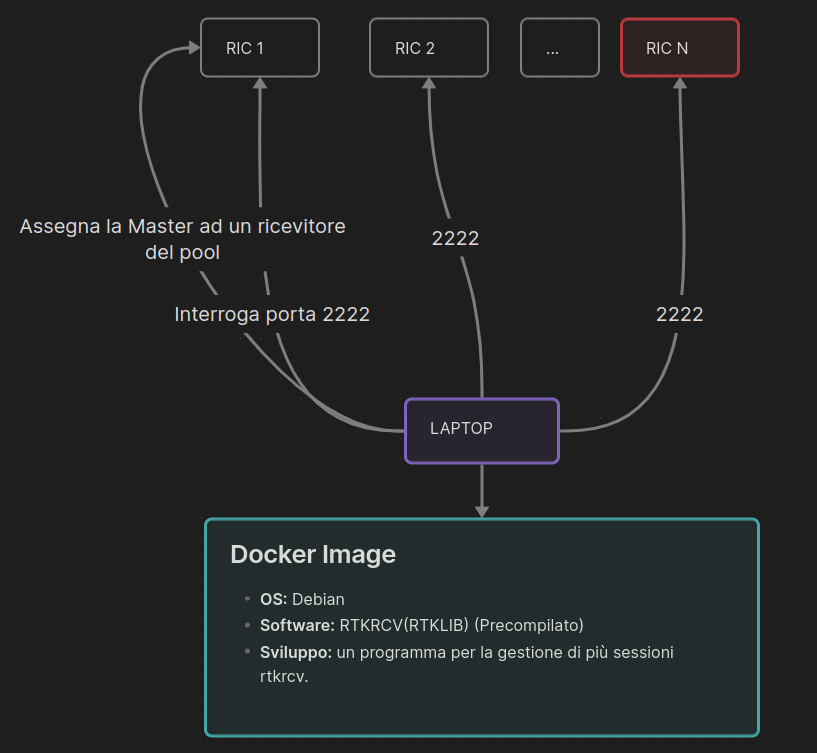
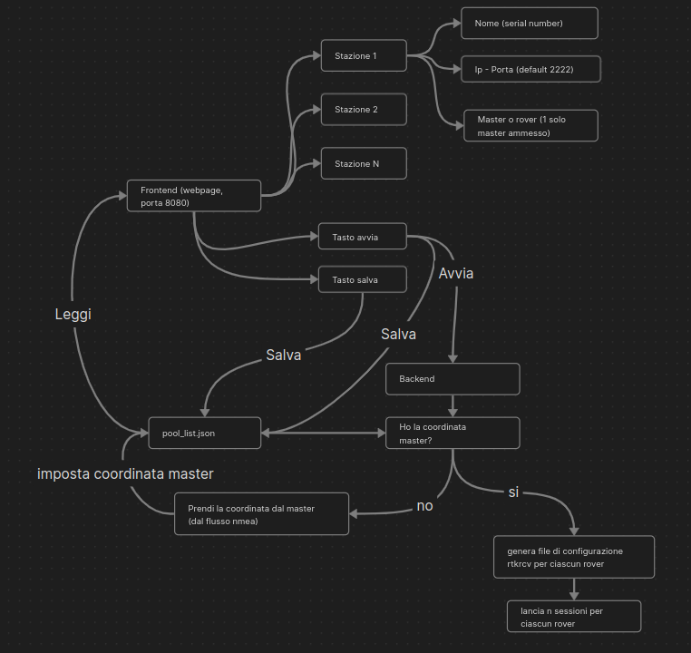

## Panoramica

Questo documento descrive un sistema progettato per gestire più ricevitori GNSS in un pool, coordinando sessioni RTKRCV tra di essi. Il sistema è composto da un’interfaccia web front-end, un servizio back-end e canali di comunicazione con vari ricevitori GNSS. L’obiettivo principale è facilitare la configurazione e la gestione di più sessioni RTK (Real-Time Kinematic) utilizzando l’utilità RTKRCV di RTKLIB.

## Architettura del Sistema

### 1. Pool di Dispositivi GNSS




Il sistema è costruito attorno a un pool di ricevitori GNSS con le seguenti caratteristiche:

- Più ricevitori GNSS (RIC 1, RIC 2, ... RIC N) connessi a un laptop centrale
    
- Tutti i ricevitori comunicano via TCP/IP sulla porta 2222 (di default)
    
- Un ricevitore del pool è designato come Master, gli altri come Rover
    
- Il sistema gira in un container Docker con:
    
    - Sistema operativo Debian
        
    - RTKRCV precompilato (da RTKLIB)
        
    - Software personalizzato per la gestione di sessioni multiple RTKRCV
        

#### Flusso di Connessione:

1. Il laptop interroga ciascun ricevitore sulla porta 2222
    
2. Il laptop assegna un ricevitore come Master
    
3. Il sistema stabilisce la comunicazione con tutti i ricevitori del pool
    

### 2. Gestione delle Sessioni



La gestione delle sessioni avviene tramite un'interfaccia web sulla porta 8080 con i seguenti componenti:

#### Componenti Front-end:

- Interfaccia per configurare le stazioni, con campi per:
    
    - Nome/n° seriale della stazione
        
    - Indirizzo IP e porta (di default 2222)
        
    - Ruolo (Master o Rover, con un solo Master consentito)
        
- Pulsante **Salva** per salvare le configurazioni
    
- Pulsante **Avvia** per avviare le sessioni
    

#### Flusso del Processo Back-end:

1. L’utente configura le stazioni tramite l’interfaccia web
    
2. La configurazione viene salvata in `pool_list.json`
    
3. Quando si preme **Avvia**:
    
    - Il sistema verifica se le coordinate del Master sono disponibili
        
    - Se assenti, le recupera dallo stream NMEA del Master
        
    - Le coordinate vengono salvate nella configurazione
        
4. Per ogni Rover:
    
    - Viene generato un file di configurazione RTKRCV
        
    - Vengono lanciate le sessioni RTKRCV individuali
        

### 3. Funzionamento di una Singola Sessione


Ogni sessione RTKRCV funziona nel seguente modo:

1. Riceve due flussi in ingresso:
    
    - Flusso del Rover (NMEA e dati grezzi)
        
    - Flusso del Caster (NMEA e dati grezzi)
        
2. La posizione del Master viene estratta dalle stringhe NMEA
    
3. RTKRCV elabora i flussi di dati
    
4. Il flusso NMEA differenziale in uscita viene scritto in un file di testo
    

## Flusso Operativo

1. **Configurazione del Sistema**:
    
    - L’utente accede all’interfaccia web sulla porta 8080
        
    - Configura ciascun ricevitore GNSS (nome, IP:porta, ruolo)
        
    - Salva la configurazione in `pool_list.json`
        
2. **Avvio delle Sessioni**:
    
    - L’utente clicca sul pulsante **Avvia**
        
    - Il back-end carica la configurazione da `pool_list.json`
        
    - Verifica la presenza delle coordinate del Master
        
    - Se mancanti, le recupera dallo stream NMEA del Master
        
    - Aggiorna la configurazione con le coordinate del Master
        
3. **Creazione delle Sessioni RTKRCV**:
    
    - Per ogni Rover viene generato un file di configurazione
        
    - Ogni configurazione include le coordinate del Master
        
    - Vengono lanciati i processi RTKRCV individuali
        
4. **Funzionamento delle Sessioni**:
    
    - Ogni sessione RTKRCV elabora i dati dal proprio Rover e dal Master
        
    - Il flusso NMEA differenziale in uscita viene scritto in file di testo dedicati
        
    - Il sistema mantiene tutte le sessioni attive fino a interruzione manuale
        

## Implementazione Tecnica

### Ambiente Docker

- OS base: Debian
    
- Software preinstallato: RTKRCV da RTKLIB (precompilato)
    
- Software personalizzato per la gestione delle sessioni
    

### Interfaccia Front-end

- Interfaccia web sulla porta 8080
    
- Permette la configurazione di più stazioni
    
- Fornisce controlli per avvio e salvataggio sessioni
    

### Servizio Back-end

- Legge e scrive la configurazione `pool_list.json`
    
- Gestisce l’acquisizione delle coordinate del Master
    
- Genera file di configurazione RTKRCV
    
- Avvia e monitora più processi RTKRCV
    

### Flusso dei Dati

- I dati NMEA e raw vengono ricevuti da tutti i dispositivi GNSS
    
- Le coordinate del Master vengono estratte dalle stringhe NMEA
    
- RTKRCV elabora i dati per il posizionamento RTK
    
- I flussi NMEA differenziali vengono salvati in file di testo
    

## Struttura del File di Configurazione

Il sistema utilizza un file di configurazione in formato JSON (`pool_list.json`) per salvare le informazioni sui ricevitori GNSS:
```
{
  "stations": [
    {
      "name": "STATION1",
      "ip": "192.168.1.101",
      "port": 2222,
      "role": "master",
      "coordinates": {
        "lat": 45.12345,
        "lon": 9.12345,
        "height": 123.45
      }
    },
    {
      "name": "STATION2",
      "ip": "192.168.1.102",
      "port": 2222,
      "role": "rover"
    },
    {
      "name": "STATION3",
      "ip": "192.168.1.103",
      "port": 2222,
      "role": "rover"
    }
  ]
}

```
## Generazione della Configurazione RTKRCV

Per ogni Rover, il sistema genera un file di configurazione RTKRCV contenente:

- Configurazioni dei flussi in ingresso (Rover e Master)
    
- Configurazione del flusso in uscita (file di testo)
    
- Parametri di elaborazione
    
- Coordinate della stazione Master
    
- Altre impostazioni specifiche di RTKLIB
    

## Possibili future implementazioni

1. **Gestione degli Errori e Recupero**:
    - L’attuale progettazione non gestisce esplicitamente errori di connessione o interruzioni di flusso
    - Considerare l’implementazione di tentativi di riconnessione e riavvio automatico delle sessioni
2. **Monitoraggio e Stato**: 
    - Visualizzare lo stato di tutte le sessioni attive e la salute delle connessioni
3. **Logging e Diagnostica**:
    - Implementare log dettagliati per il troubleshooting
# Conclusione
Questo sistema di gestione Multi-Sessione RTKRCV per ricevitori GNSS offre un modo semplificato per gestire più ricevitori GNSS per il posizionamento RTK. Combinando un'interfaccia web intuitiva con un potente back-end di elaborazione, semplifica la configurazione e il funzionamento delle sessioni RTKRCV. Il sistema è progettato per essere distribuito all'interno di un container Docker, rendendolo portabile e facile da implementare in diversi ambienti.

Il design modulare consente futuri miglioramenti e personalizzazioni per soddisfare requisiti specifici nell’elaborazione dei dati GNSS e nelle applicazioni di posizionamento RTK.
